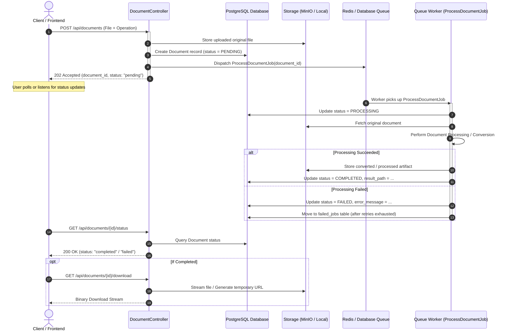

# 📄 Document Processing Platform

> A resilient document processing platform demonstrating the complete lifecycle of asynchronous background jobs in **Laravel**.

[](https://laravel.com)
[](https://php.net)
[](https://www.postgresql.org)
[](https://redis.io)
[](https://www.docker.com)

---

## 🎯 1. Project Objective & Scope

The primary objective of this project is to build a robust document-processing platform that demonstrates how a modern Laravel backend handles long-running tasks asynchronously without blocking the user interface or HTTP request lifecycle.

### Core User Workflow
1. **Upload a Supported Document**: User uploads a document (e.g., PDF, DOCX, CSV, Image).
2. **Select Processing Operation**: Choose an operation (e.g., conversion, compression, watermarking, text extraction).
3. **Submit Request**: Submit the job to the backend.
4. **Immediate Response**: Receive an instant HTTP acknowledgement (`202 Accepted`) with a tracking token / task ID.
5. **Monitor Status**: Check processing state in real time or via polling (`pending` ➔ `processing` ➔ `completed` / `failed`).
6. **Download Result**: Safely download the processed artifact upon completion.

### 💡 Main Learning Objective
Master the end-to-end lifecycle of an asynchronous job in Laravel:
- **Dispatching**: Offloading heavy I/O and CPU-bound operations from the HTTP layer to the queue.
- **Worker Execution**: Managing background queue workers, concurrency, timeouts, and rate limits.
- **State Management**: Accurately persisting and communicating task status transitions.
- **Failure Handling**: Handling unexpected errors, timeouts, retries, and inspecting the `failed_jobs` table.

---

## 🔄 2. Asynchronous Job Lifecycle



---

## 🛠️ 3. Tech Stack & Infrastructure

- **Framework**: [Laravel](https://laravel.com) (PHP 8.3+)
- **Database**: PostgreSQL (Production-grade relational store for tracking document states)
- **Queue / Cache**: Redis / PostgreSQL Queue
- **Object Storage**: MinIO (S3-compatible storage) or Laravel Local Storage
- **Container Environment**: Docker & [Laravel Sail](https://laravel.com/docs/sail)
- **Local Mail Testing**: Mailpit (for asynchronous email notifications upon job completion)

---

## 🚀 4. Getting Started

### Prerequisites
- Docker Desktop (or Docker Engine on Linux / WSL2)
- Git

### Installation & Setup

1. **Clone the repository**:
   ```bash
   git clone <repository-url> document-convert
   cd document-convert
   ```

2. **Setup environment file**:
   ```bash
   cp .env.example .env
   ```

3. **Start Docker containers using Laravel Sail**:
   ```bash
   ./vendor/bin/sail up -d
   ```

4. **Generate Application Key**:
   ```bash
   ./vendor/bin/sail artisan key:generate
   ```

5. **Run Database Migrations**:
   ```bash
   ./vendor/bin/sail artisan migrate
   ```

6. **Start the Queue Worker**:
   > **Note**: To process background jobs in real-time, keep a queue worker running:
   ```bash
   ./vendor/bin/sail artisan queue:work --tries=3 --timeout=120
   ```

---

## 📡 5. API Reference & Contract

### 1. Submit Document for Processing
- **Endpoint**: `POST /api/documents`
- **Content-Type**: `multipart/form-data`
- **Payload**:
  - `file`: (binary, required) The input document (PDF, DOCX, etc.)
  - `operation`: (string, required) E.g., `pdf_to_text`, `compress_pdf`, `convert_to_pdf`
- **Response** (`202 Accepted`):
  ```json
  {
    "message": "Document processing request accepted.",
    "data": {
      "id": "9d901cb2-20f3-4f99-8472-a16df5f8a07c",
      "original_name": "quarterly-report.docx",
      "operation": "convert_to_pdf",
      "status": "pending",
      "created_at": "2026-09-16T07:15:00Z"
    }
  }
  ```

### 2. Check Processing Status
- **Endpoint**: `GET /api/documents/{id}/status`
- **Response** (`200 OK` - Processing / Completed):
  ```json
  {
    "id": "9d901cb2-20f3-4f99-8472-a16df5f8a07c",
    "status": "completed",
    "progress": 100,
    "error_message": null,
    "completed_at": "2026-09-16T07:15:14Z",
    "download_url": "/api/documents/9d901cb2-20f3-4f99-8472-a16df5f8a07c/download"
  }
  ```

### 3. Download Processed Document
- **Endpoint**: `GET /api/documents/{id}/download`
- **Response**: Binary file stream or direct signed download URL.

---

## 🛡️ 6. Error Handling & Dead Letter Queue

To achieve resilience in background jobs:
- **Automatic Retries**: Jobs can be configured with automatic back-off delays (e.g. `$tries = 3; $backoff = [10, 30, 60];`).
- **Dead-Letter Handling (`failed_jobs`)**: If processing fails after all retry attempts, Laravel registers the job in the `failed_jobs` table and triggers the `failed(Throwable $exception)` hook to notify the user and flag the document as `failed`.
- **Worker Inspection Commands**:
  ```bash
  # View all failed background jobs
  ./vendor/bin/sail artisan queue:failed

  # Retry a specific failed job
  ./vendor/bin/sail artisan queue:retry <job-id>

  # Retry all failed jobs
  ./vendor/bin/sail artisan queue:retry all
  ```

---

## 📂 7. Project Structure

```text
├── app/
│   ├── Http/
│   │   └── Controllers/       # Handles upload, status check, and download routes
│   ├── Jobs/                  # Asynchronous queue jobs (ProcessDocumentJob.php)
│   ├── Models/                # Eloquent models (Document.php)
│   └── Services/              # Document conversion & processing engines
├── compose.yaml               # Sail services (Postgres, Redis, MinIO, Mailpit)
├── config/queue.php           # Queue driver configuration
├── database/migrations/       # Tables for documents, jobs, and failed_jobs
└── routes/
    ├── api.php                # Document conversion API endpoints
    └── web.php                # Web routes & demo UI
```

---

## 📄 License
This project is open-sourced under the [MIT license](LICENSE).
